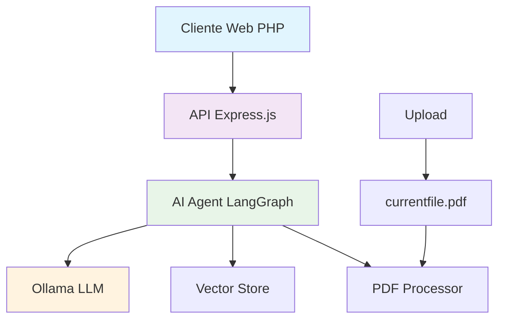

# 🚀 Fast PDF
  
  
  
  **Una herramienta inteligente para resumir, buscar y comprender documentos PDF con IA**
  
  [](https://nodejs.org/)
  [](https://www.typescriptlang.org/)
  [](https://expressjs.com/)
  [](https://langchain.com/)
  [](https://ollama.ai/)

---

## ✨ Características

- 🔍 **Análisis Inteligente**: Procesa y comprende documentos PDF usando IA local
- 💬 **Chat Interactivo**: Haz preguntas específicas sobre el contenido del PDF
- 🎯 **Búsqueda Semántica**: Encuentra información relevante usando embeddings vectoriales
- 🔒 **Privacidad Total**: Los documentos se procesan localmente, sin envío a servicios externos
- ⚡ **Rápido y Eficiente**: Optimizado para respuestas instantáneas
- 🎨 **Interfaz Moderna**: Diseño limpio e intuitivo con drag & drop

## 🏗️ Arquitectura



## 🚀 Inicio Rápido

### Prerrequisitos

- **Docker** - [Instalar Docker](https://docs.docker.com/get-docker/)
- **Ollama** - [Instalar Ollama](https://ollama.ai/download)

### Configuración de Ollama

```bash
# Instalar los modelos necesarios
ollama pull nomic-embed-text
ollama pull llama3.2
```

### Instalación y Ejecución

1. **Clonar el repositorio**
   ```bash
   git clone <repository-url>
   cd fast-pdf
   ```

2. **Iniciar el proyecto**
   ```bash
   docker compose up
   ```

3. **¡Listo!** 
   - La aplicación estará disponible automáticamente
   - El frontend y backend se configuran automáticamente con Docker

## 📁 Estructura del Proyecto

```
fast-pdf/
├── src/
│   ├── backend/
│   │   ├── ai-agent/
│   │   │   └── ai-agent.ts      # Motor de IA con LangGraph
│   │   └── routes/
│   │       ├── chat.ts          # Endpoint de chat
│   │       └── uploads.ts       # Manejo de archivos
│   ├── client/
│   │   ├── index.php           # Interfaz principal
│   │   ├── styles.css          # Estilos
│   │   └── img/                # Assets
│   └── index.ts                # Servidor Express
├── package.json
└── README.md
```

## 🔧 Tecnologías Utilizadas

### Backend
- **Express.js** - Framework web para Node.js
- **TypeScript** - Tipado estático para JavaScript
- **LangChain** - Framework para aplicaciones de IA
- **LangGraph** - Orquestación de flujos de IA
- **Ollama** - Modelos de IA local

### Frontend
- **PHP** - Servidor web simple
- **HTML5 & CSS3** - Interfaz de usuario moderna
- **JavaScript** - Interactividad del cliente

### IA y Procesamiento
- **llama3.2** - Modelo de lenguaje principal
- **nomic-embed-text** - Modelo de embeddings
- **Vector Store** - Búsqueda semántica
- **PDF Loader** - Procesamiento de documentos

## 💡 Cómo Funciona

1. **📤 Upload**: El usuario sube un PDF que se guarda como `currentfile.pdf`
2. **🔄 Procesamiento**: El AI Agent verifica si el archivo cambió y lo procesa si es necesario
3. **📊 Vectorización**: El contenido se convierte en embeddings para búsqueda semántica
4. **💬 Chat**: El usuario hace preguntas y el sistema busca información relevante
5. **🎯 Respuesta**: La IA genera respuestas contextuales basadas en el contenido del PDF

## 🎯 Características Técnicas

- **🧠 Memoria Persistente**: Mantiene el contexto durante la sesión
- **⚡ Caché Inteligente**: Solo reprocesa el PDF si cambia
- **🔍 RAG (Retrieval Augmented Generation)**: Combina búsqueda y generación
- **🏠 Procesamiento Local**: Sin dependencia de APIs externas
- **🔒 Privacidad**: Los documentos nunca salen de tu máquina

## 🛠️ Desarrollo

### Scripts Disponibles

```bash
docker compose up      # Iniciar toda la aplicación
docker compose down    # Detener la aplicación
docker compose logs    # Ver logs del sistema
```

### Variables de Entorno

```env
PORT=3000                           # Puerto del servidor
OLLAMA_BASE_URL=host.docker.internal:11434  # URL de Ollama
```

## 📝 API Endpoints

### Upload de Archivos
```http
POST /uploads
Content-Type: multipart/form-data

FormData: file (PDF)
```

### Chat con IA
```http
POST /chat/query
Content-Type: application/json

{
  "question": "¿De qué trata este documento?",
  "thread": "optional-thread-id"
}
```

## 🤝 Contribuir

1. Fork el proyecto
2. Crea una rama para tu feature (`git checkout -b feature/AmazingFeature`)
3. Commit tus cambios (`git commit -m 'Add some AmazingFeature'`)
4. Push a la rama (`git push origin feature/AmazingFeature`)
5. Abre un Pull Request

## 📄 Licencia

Este proyecto está bajo la licencia MIT. Ver el archivo `LICENSE` para más detalles.

## 🙏 Agradecimientos

- [Ollama](https://ollama.ai/) por los modelos de IA local
- [LangChain](https://langchain.com/) por el framework de IA
- [LangGraph](https://langgraph-sdk.vercel.app/) por la orquestación de agentes

---
  
  **¿Te gusta Fast PDF? ¡Dale una ⭐ al repositorio!**
  
  Hecho con ❤️ para la comunidad de desarrolladores